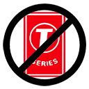

# Bich Lasagna

##### Chromium/Chrome Extension to unsubscribe from [T-Series](https://www.youtube.com/user/tseries) and subscribe to [PewDiePie](https://www.youtube.com/user/pewdiepie)

# WARNING

**This extension is/was made for *educational purpose only* and should be used under your own risk. I am not responsible for any problems/damages caused by the usage of this extension.**

### What does the extension do?

This extension *quietly* opens a new tab, subscribes to PewDiePie and Unsubscribes from T-Series whenever someone loads their Gmail page on a **supported** Chrome browser.

### Why?

Why not?

### Why don't you support T-Series?

Simple. I don't want YouTube to be dominated by big giant companies that spits out 5 new videos every hour.

### Browser support

This extension only works on Chromium/Chrome browser. FYI: [59.69% of the world uses Chromium/Chrome](https://en.wikipedia.org/wiki/Usage_share_of_web_browsers)

### Installation

Since this extension is not available on the Chrome Web Store, you have to do a bit of *hackerman* stuff to get this extension working. Now if anyone would be kind enough to invest and get this extension on the Chrome Web Store, I'd be happy! Please feel free to publish the extension. Ok! So, follow the steps given below:

0. Download ZIP of this repository and extract it somewhere on your machine.
1. Visit `chrome://extensions` (or menu -> More Tools -> Extensions)
2. Enable Developer mode by ticking the checkbox in the upper-right corner.
3. Click on the "Load unpacked" button in the upper-left corner.
4. Select the directory containing this extension.
5. T-Pose to defeat T-Series

#### Please report any issues that you encounter! Happy sub-botting :wink:

<b>Please sub to Pewds!</b>

<h1>SAVE YOUTUBE!</h1>

